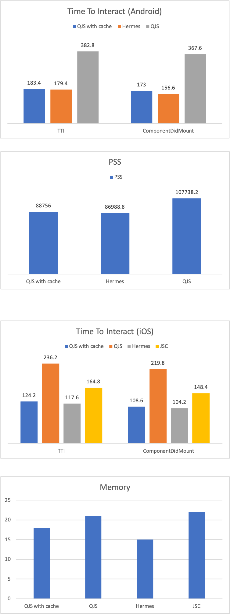
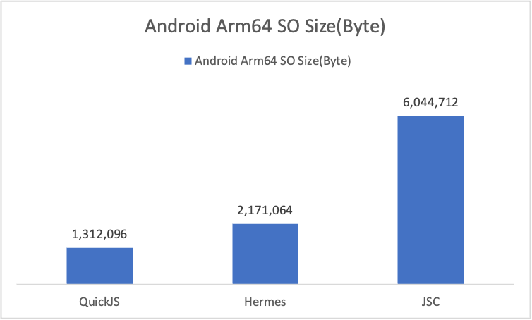

## Benchmark Results

Android 11 OnePlus 7t, iOS 13.3 iPhone 11 Pro.




## Benchmark
1. Speed
   1. TTI (Time-To-Interaction). On Android, it measures from  "Activity.onCreate" to "CONTENT_APPEARED". On iOS, it measures from "AppDelegate.initialize" to "contentDidAppear".
   2. ComponentDidMount. On Android, it measures from native "Activity.onCreate" to JS "FlatListDemo.ComponentDidMount". On iOS, it measures from native "AppDelegate.initialize" to JS "FlatListDemo.ComponentDidMount".

2. Memory
   1. We sampled PSS on Android and footprint memory on iOS after QuickJSExample had finished loading for about 5s.

## How to Run it on your device

1. Install QuickJSExample in this project according to README.md in release mode. For iOS it needs to set the "Optimization level" to "Fastest(-O3)" but not "Fastest, Smallest(-Os)" in project's "Build Settings" in XCode to enable console log.  
2. Just launch the app.
3. On Android it prints like:
```java
    FLog.e("TTIRecorder", "TTI: " + mTTI + " : " + "ComponentDidMount: " + mComponentDidMount);
```
4. On iOS it prints like:
```c
    printf("TTI: %f ComponentDidMount: %f", tti * 1000, componentDidMount * 1000);
```

## Implementation details

1. For convenience, QuickJS's code cache is generated and saved on device. There is writing costs for the first launch and reading costs afterward. Hermes precompiles bundle into byte codes as an asset in application.
2. The compile flags for QuickJS include "-O2".
3. The example contains a simple flatlist with 20 items.
